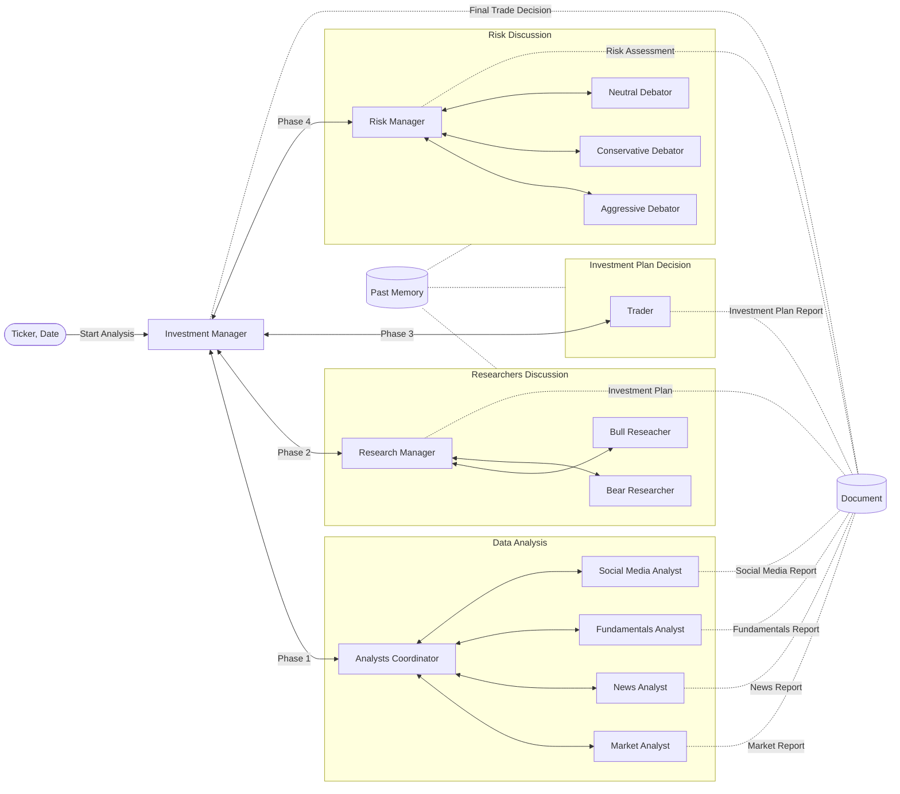

# Investment Agents

This project implements a multi-agent system for investment analysis. It orchestrates various agents (Analysts, Researchers, Traders, Risk Managers) to evaluate financial assets and generate investment recommendations.

## Features

- **Multi-Agent Architecture**: Coordinates specialized agents for fundamental analysis, market analysis, research, trading strategies, and risk management.
- **Automated Workflow**: Runs a complete investment decision from data gathering to final decision.
- **Report Generation**: Generates detailed Markdown reports for each analysis session.
- **Agent-to-Agent (A2A) Communication**: Utilizes A2A protocols for seamless interaction and task delegation between agents.
- **Model Context Protocol (MCP) Integration**: Leverages MCP servers for data retrieval from various sources (e.g., Finnhub, SimFin).

## Architecture



## Prerequisites

- Python >= 3.13
- [uv](https://github.com/astral-sh/uv) (for dependency management and execution)

## Installation

1.  Clone the repository:
    ```bash
    git clone <repository-url>
    cd InvestmentAgents
    ```

2.  Install dependencies using `uv`:
    ```bash
    uv sync --all-packages
    ```

## Configuration

### Environment Variables

This project uses environment variables for configuration. Create a `.env` file in the root directory.

**Note:** Some MCP servers located in `mcp-servers/` also require their own `.env` files. Please check the individual server directories for specific configuration requirements.

### Data Preparation

Some MCP servers require pre-downloading data before they can be used. You may need to run `download_data.py` scripts located in the `data/` subdirectory of specific MCP servers (e.g., `simfin-fundamentals-data-server`, `finnhub-news-data-server`, `finnhub-fundamentals-data-server`).

## Usage

### Running the Analysis

The main entry point is `main.py`. You can configure the assets, date range, and frequency directly in the `main()` function within `main.py`.

1.  Open `main.py` and modify the configuration section:
    ```python
    def main():
        # Configuration
        assets = ["AAPL"] # Add more assets as needed
        start_date = "2025-07-01"
        end_date = "2025-08-01"
        period_type = "weekly" # Options: "weekly", "biweekly", "monthly"
        # ...
    ```

2.  Run the analysis using `uv`:
    ```bash
    uv run main.py
    ```

### Output

- **Reports**: Generated Markdown reports are saved in the `reports/` directory. The filename format is `report_{ticker}_{date}.md`.
- **Shared State**: The intermediate state and agent outputs are stored in `data/shared_document.json`.

## Project Structure

- `agents/`: Contains the implementation of various agents (Investment Manager, Analysts, Researchers, etc.).
- `data/`: Stores shared state, session data, and market/fundamental data.
- `mcp-servers/`: Model Context Protocol servers for data retrieval.
- `utils/`: Utility scripts (e.g., report generation).
- `main.py`: Main script to run the investment analysis workflow.
- `pyproject.toml`: Project configuration and dependencies.
