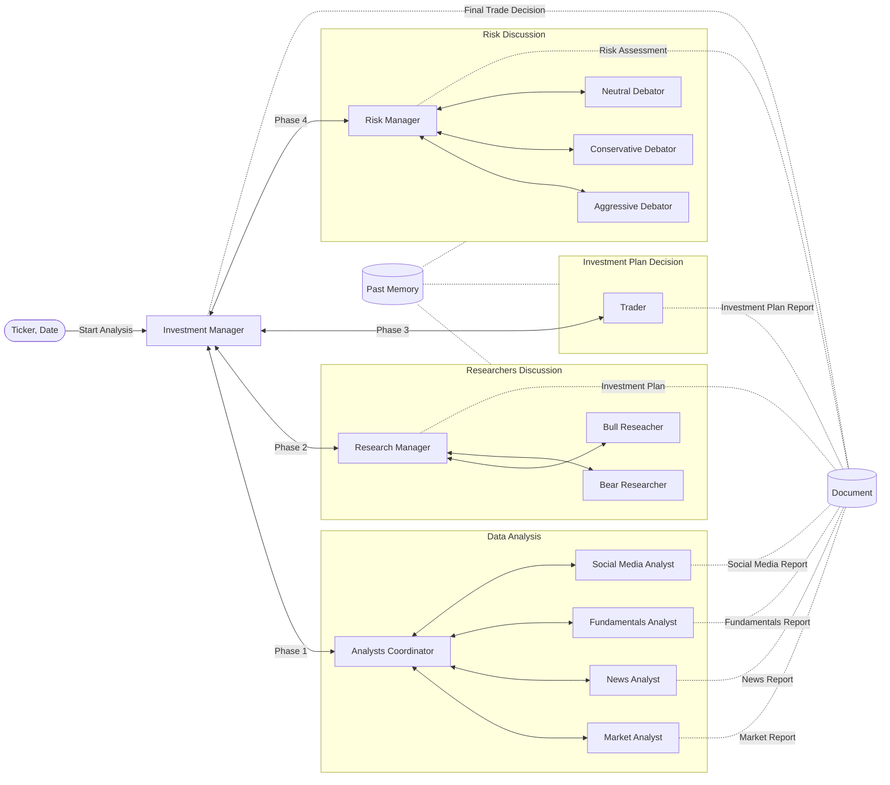

# Investment Agents

This project implements a multi-agent system for investment analysis. It orchestrates various agents (Analysts, Researchers, Traders, Risk Managers) to evaluate financial assets and generate investment recommendations.

## Features

- **Multi-Agent Architecture**: Coordinates specialized agents for fundamental analysis, market analysis, research, trading strategies, and risk management.
- **Automated Workflow**: Runs a complete investment decision from data gathering to final decision.
- **Report Generation**: Generates detailed Markdown reports for each analysis session.
- **Agent-to-Agent (A2A) Communication**: Utilizes A2A protocols for seamless interaction and task delegation between agents.
- **Model Context Protocol (MCP) Integration**: Leverages MCP servers for data retrieval from various sources (e.g., Finnhub, SimFin).

## Architecture


```mermaid
flowchart LR
 subgraph subGraph0["Data Analysis"]
    direction TB
        AC["Analysts Coordinator"]
        MA["Market Analyst"]
        NA["News Analyst"]
        FA["Fundamentals Analyst"]
        SA["Social Media Analyst"]
  end
 subgraph subGraph1["Researchers Discussion"]
        BR["Bull Reseacher"]
        BER["Bear Researcher"]
        RM["Research Manager"]
  end
 subgraph subGraph2["Investment Plan Decision"]
        TR["Trader"]
  end
 subgraph subGraph3["Risk Discussion"]
        AD["Aggressive Debator"]
        CD["Conservative Debator"]
        ND["Neutral Debator"]
        RMG["Risk Manager"]
  end
    Init(["Ticker, Date"]) -- Start Analysis --> IM["Investment Manager"]
    IM <-- Phase 1 --> AC
    AC <--> MA & NA & FA & SA
    IM <-- Phase 2 --> RM
    RM <--> BR & BER
    IM <-- Phase 3 --> TR
    IM <-- Phase 4 --> RMG
    RMG <--> AD & CD & ND
    MA -. Market Report .- State["Document"]
    NA -. News Report .- State
    FA -. Fundamentals Report .- State
    SA -. Social Media Report .- State
    RM -. Investment Plan .- State
    TR -. Investment Plan Report .- State
    RMG -. Risk Assessment .- State
    IM -. Final Trade Decision .- State
    State@{ shape: db}
    Memory["Past Memory"]
    Memory@{ shape: db}
    Memory -.- subGraph1 & subGraph2 & subGraph3
```

## Prerequisites

- Python >= 3.13
- [uv](https://github.com/astral-sh/uv) (for dependency management and execution)

## Installation

1.  Clone the repository:
    ```bash
    git clone <repository-url>
    cd InvestmentAgents
    ```

2.  Install dependencies using `uv`:
    ```bash
    uv sync --all-packages
    ```

## Code Quality

Run these commands from the repository root after installing dependencies:

```bash
uv run pre-commit install --install-hooks
uv run pre-commit run --all-files
```

Each new clone needs to install the hooks once. Before each commit, the hooks
check staged files using pinned tool versions in isolated environments.

- **Ruff** checks Python errors and unused imports, sorts imports, and applies
  safe fixes.
- **Black** formats Python for Python 3.13 with an 88-character line length.
- **detect-secrets** checks credential patterns, hardcoded secret assignments,
  and high-entropy strings. It runs offline with `--no-verify`. No baseline
  suppresses existing findings.
- Additional checks catch private keys, conflict markers, case-conflicting
  filenames, newly added files larger than 1 MiB, invalid TOML/YAML/JSON, and
  whitespace issues.

If a formatter changes files, review and stage the changes, then retry the commit.
Remove credentials identified by the secret scanner and use environment variables;
rotate any real exposed credential. Only confirmed harmless false positives
should use the inline `# pragma: allowlist secret` annotation. See the
[detect-secrets documentation](https://github.com/Yelp/detect-secrets#inline-allowlisting).
The hooks check file contents rather than Git history.

Run the offline regression suite separately:

```bash
uv run python -m unittest discover -s tests -v
```

## Dependency Updates

The root `uv.lock` pins dependencies for the entire workspace, including all MCP
servers. Run dependency commands from the repository root:

```bash
uv lock --upgrade
uv sync --all-packages --locked
uv run python -m unittest discover -s tests -v
uv run pre-commit run --all-files
```

Review major-version changes and update the minimum versions in each affected
`pyproject.toml` after validating compatibility. Keep explicit upper bounds when
required by a service; DuckDuckGo news currently stays on `ddgs` 9.x.
The pre-commit runner stays on 4.5.x for compatibility with Git 2.25 in the
WSL environment; newer runner versions require a newer Git for full-repo scans.

## Configuration

### Environment Variables

This project uses environment variables for configuration. Create a `.env` file in the root directory.

**Note:** Some MCP servers located in `mcp-servers/` also require their own `.env` files. Please check the individual server directories for specific configuration requirements.

### Data Preparation

Some MCP servers require pre-downloading data before they can be used. You may need to run `download_data.py` scripts located in the `data/` subdirectory of specific MCP servers (e.g., `simfin-fundamentals-data-server`, `finnhub-news-data-server`, `finnhub-fundamentals-data-server`).

## Usage

### Running the Analysis

The main entry point is `main.py`. You can configure the assets, date range, and frequency directly in the `main()` function within `main.py`.

1.  Open `main.py` and modify the configuration section:
    ```python
    def main():
        # Configuration
        assets = ["AAPL"] # Add more assets as needed
        start_date = "2025-07-01"
        end_date = "2025-08-01"
        period_type = "weekly" # Options: "weekly", "biweekly", "monthly"
        # ...
    ```

2.  Run the analysis using `uv`:
    ```bash
    uv run main.py
    ```

### Output

- **Reports**: Generated Markdown reports are saved in the `reports/` directory. The filename format is `report_{ticker}_{date}.md`.
- **Shared State**: The intermediate state and agent outputs are stored in `data/shared_document.json`.

## Project Structure

- `agents/`: Contains the implementation of various agents (Investment Manager, Analysts, Researchers, etc.).
- `data/`: Stores shared state, session data, and market/fundamental data.
- `mcp-servers/`: Model Context Protocol servers for data retrieval.
- `utils/`: Utility scripts (e.g., report generation).
- `main.py`: Main script to run the investment analysis workflow.
- `pyproject.toml`: Project configuration and dependencies.
