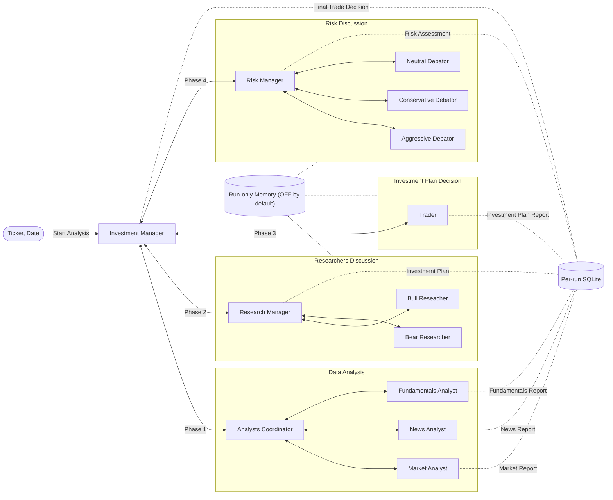

# Investment Agents

This project implements a multi-agent system for investment analysis. It orchestrates various agents (Analysts, Researchers, Traders, Risk Managers) to evaluate financial assets and generate investment recommendations.

## Features

- **Multi-Agent Architecture**: Coordinates specialized agents for fundamental analysis, market analysis, research, trading strategies, and risk management.
- **Automated Workflow**: Runs a complete investment decision from data gathering to final decision.
- **Report Generation**: Generates detailed Markdown reports for each analysis session.
- **Run isolation**: Each execution owns its SQLite state, sessions, optional memory, caches and reports. In-process agents call children as tools; A2A entry points are currently disabled.
- **Model Context Protocol (MCP) Integration**: Leverages MCP servers for data retrieval from various sources (e.g., Finnhub, SimFin).

## Architecture


```mermaid
flowchart LR
 subgraph subGraph0["Data Analysis"]
    direction TB
        AC["Analysts Coordinator"]
        MA["Market Analyst"]
        NA["News Analyst"]
        FA["Fundamentals Analyst"]
  end
 subgraph subGraph1["Researchers Discussion"]
        BR["Bull Reseacher"]
        BER["Bear Researcher"]
        RM["Research Manager"]
  end
 subgraph subGraph2["Investment Plan Decision"]
        TR["Trader"]
  end
 subgraph subGraph3["Risk Discussion"]
        AD["Aggressive Debator"]
        CD["Conservative Debator"]
        ND["Neutral Debator"]
        RMG["Risk Manager"]
  end
    Init(["Ticker, Date"]) -- Start Analysis --> IM["Investment Manager"]
    IM <-- Phase 1 --> AC
    AC <--> MA & NA & FA
    IM <-- Phase 2 --> RM
    RM <--> BR & BER
    IM <-- Phase 3 --> TR
    IM <-- Phase 4 --> RMG
    RMG <--> AD & CD & ND
    MA -. Market Report .- State["Per-run SQLite"]
    NA -. News Report .- State
    FA -. Fundamentals Report .- State
    RM -. Investment Plan .- State
    TR -. Investment Plan Report .- State
    RMG -. Risk Assessment .- State
    IM -. Final Trade Decision .- State
    State@{ shape: db}
    Memory["Run-only Memory (OFF by default)"]
    Memory@{ shape: db}
    Memory -.- subGraph1 & subGraph2 & subGraph3
```

## Agent hook contracts

Each agent's `hook.py` selects an immutable contract from
`agents/hooks/specs.py`. Contracts declare input keys, missing-value defaults,
refresh timing, prompt bindings, output keys/aliases, memory queries and workflow
policy. Update the contract together with `prompt.txt` when changing an agent.
The shared provider validates placeholders before execution and requires nonempty
`ticker` and `current_date`; upstream reports remain optional for standalone use.

`agents/hooks/lifecycle.py` loads invocation inputs, prepares workflow state,
renders the original template and finalizes successful assistant results. Report
text is extracted once, committed to the run's SQLite store, then passed to memory. Failed or
incomplete invocations cannot reuse an older report from message history.

Research and risk managers use a deterministic `DebateRunner`: opening,
rebuttal and clarification each require every configured participant once.
Participants receive the same snapshot of prior completed rounds. Contributions
are staged, published together after a complete round, then stored in memory.
The manager synthesizes the full accepted history with no participant tools.
Failed or cancelled rounds cannot publish partial arguments or trigger synthesis.

The in-process managers run this scheduler through `invoke_async`, `stream_async`
and their public tools. Same-agent calls serialize the whole lifecycle, including
conversation resets. All A2A constructors, server factories and manual clients
reject execution before side effects until distributed run ownership is specified.
This includes servers that previously wrapped local participants; ports are reserved
unchanged. Top-level investment phase sequencing stays prompt-driven.

SQLite transactions publish complete rounds and aliases, fence stale debate
generations and reject conflicting writes. Memory runs only after commit. An
owned-agent failure prevents run success even when the parent model continues
after an SDK tool error. Committed reports remain available for diagnosis.

See [the implementation specification](specs/002-agent-hook-contracts/spec.md).
The debate behavior change is specified separately in
[003 - Participant-aware debates](specs/003-participant-debates/spec.md).
Run offline checks from the repository root:

```bash
uv run python -m unittest discover -s tests -v
```

The isolation contract and acceptance matrix are in
[001 - Run isolation](specs/001-run-isolation/README.md).

## Prerequisites

- Python >= 3.13
- [uv](https://github.com/astral-sh/uv) (for dependency management and execution)

## Installation

1.  Clone the repository:
    ```bash
    git clone <repository-url>
    cd InvestmentAgents
    ```

2.  Install dependencies using `uv`:
    ```bash
    uv sync --all-packages
    ```

## Code Quality

Run these commands from the repository root after installing dependencies:

```bash
uv run pre-commit install --install-hooks
uv run pre-commit run --all-files
```

Each new clone needs to install the hooks once. Before each commit, the hooks
check staged files using pinned tool versions in isolated environments.

- **Ruff** checks Python errors and unused imports, sorts imports, and applies
  safe fixes.
- **Black** formats Python for Python 3.13 with an 88-character line length.
- **detect-secrets** checks credential patterns, hardcoded secret assignments,
  and high-entropy strings. It runs offline with `--no-verify`. No baseline
  suppresses existing findings.
- Additional checks catch private keys, conflict markers, case-conflicting
  filenames, newly added files larger than 1 MiB, invalid TOML/YAML/JSON, and
  whitespace issues.

If a formatter changes files, review and stage the changes, then retry the commit.
Remove credentials identified by the secret scanner and use environment variables;
rotate any real exposed credential. Only confirmed harmless false positives
should use the inline `# pragma: allowlist secret` annotation. See the
[detect-secrets documentation](https://github.com/Yelp/detect-secrets#inline-allowlisting).
The hooks check file contents rather than Git history.

Run the offline regression suite separately:

```bash
uv run python -m unittest discover -s tests -v
```

## Dependency Updates

The root `uv.lock` pins dependencies for the entire workspace, including all MCP
servers. Run dependency commands from the repository root:

```bash
uv lock --upgrade
uv sync --all-packages --locked
uv run python -m unittest discover -s tests -v
uv run pre-commit run --all-files
```

Review major-version changes and update the minimum versions in each affected
`pyproject.toml` after validating compatibility. Keep explicit upper bounds when
required by a service; DuckDuckGo news currently stays on `ddgs` 9.x.
The pre-commit runner stays on 4.5.x for compatibility with Git 2.25 in the
WSL environment; newer runner versions require a newer Git for full-repo scans.

## Configuration

### Environment Variables

This project uses environment variables for configuration. Create a `.env` file in the root directory.

**Note:** Some MCP servers located in `mcp-servers/` also require their own `.env` files. Please check the individual server directories for specific configuration requirements.

### Data Preparation

Some MCP servers require pre-downloading data before they can be used. You may need to run `download_data.py` scripts located in the `data/` subdirectory of specific MCP servers (e.g., `simfin-fundamentals-data-server`, `finnhub-news-data-server`, `finnhub-fundamentals-data-server`).

## Usage

### Running the Analysis

The main entry point is `main.py`. You can configure the assets, date range, and frequency directly in the `main()` function within `main.py`.

1.  Open `main.py` and modify the configuration section:
    ```python
    def main():
        # Configuration
        assets = ["AAPL"] # Add more assets as needed
        start_date = "2025-07-01"
        end_date = "2025-08-01"
        period_type = "weekly" # Options: "weekly", "biweekly", "monthly"
        # ...
    ```

2.  Run the analysis using `uv`:
    ```bash
    uv run --env-file .env main.py
    ```

### Output

Every analysis receives a fresh UUID, including repeated ticker/date inputs:

```text
data/runs/<run_id>/
  run.sqlite3                # authoritative state, lifecycle and artifact hashes
  manifest.json              # derived inspection view
  shared_document.json       # final export, never live coordination
  report.md
  sessions/<agent_id>/...
  memory/<agent_id>/...       # RUN_ONLY only; vector, history and vendor stores
  cache/<provider_id>/...
```

The database is authoritative: successful files require a committed SUCCEEDED
record and matching artifact hashes. Construction, invocation, cleanup and export
failures propagate with run identity; a batch exits nonzero if any analysis fails.
Cancellation closes owned resources and remains cancellation. A hard kill may
leave CREATED/RUNNING; there is no automatic resume or takeover. Legacy global
state, memories, sessions and reports are not read, migrated or deleted.

### Single run and memory policy

```python
import asyncio
from main import run_analysis
from runtime.context import MemoryMode

result = asyncio.run(run_analysis("AAPL", "2025-08-01", memory_mode=MemoryMode.OFF))
print(result.run_id, result.report_path)
```

`OFF` is the default and never initializes Mem0 or an embedder. Opt in with
`MemoryMode.RUN_ONLY` to use private per-agent Mem0 workers. Their Ollama-compatible
defaults remain `qwen3:8b` and `embeddinggemma:latest` (768 dimensions); agent-group
model environment overrides do not configure memory. Retrieval is bound to both
run and agent. Cross-run learning and temporal evidence validation are outside
this feature.

All agent classes require `runtime=`. For custom orchestration, create a
`RunConfig`, call `create_run(config)`, then await
`runtime.execute(AgentClass, message, required_report_key)`; the runtime constructs
the tree inside its managed lifecycle. Standalone examples use the same factory:

```bash
uv run --env-file .env python -m agents.traders.trader.agent --ticker AAPL --date 2025-08-01 --memory-mode OFF
```

`RunConfig` accepts a local `output_root`, a bounded SQLite busy timeout (default
5 seconds), and a cleanup deadline (default 30 seconds). Concurrent independent
runs are supported on a local filesystem; network filesystems are unsupported.
The parent process does not switch CWD or environment to route runs. MCP children
receive private cache roots and retain their provider `.env` credential delivery.
Run identity/cache keys in those files must not conflict with host context.
Shared SimFin datasets are read-only during analysis. Direct MCP startup requires
host context; unused Google News and Mem0 MCP servers reject startup.

## Project Structure

- `agents/`: Contains the implementation of various agents (Investment Manager, Analysts, Researchers, etc.).
- `runtime/`: Run context, SQLite store, lifecycle, sessions, memory workers, MCP resources and artifact publication.
- `data/runs/`: Per-run mutable state and artifacts; legacy files remain untouched.
- `mcp-servers/`: Model Context Protocol servers for data retrieval.
- `utils/`: Utility scripts (e.g., report generation).
- `main.py`: Main script to run the investment analysis workflow.
- `pyproject.toml`: Project configuration and dependencies.
