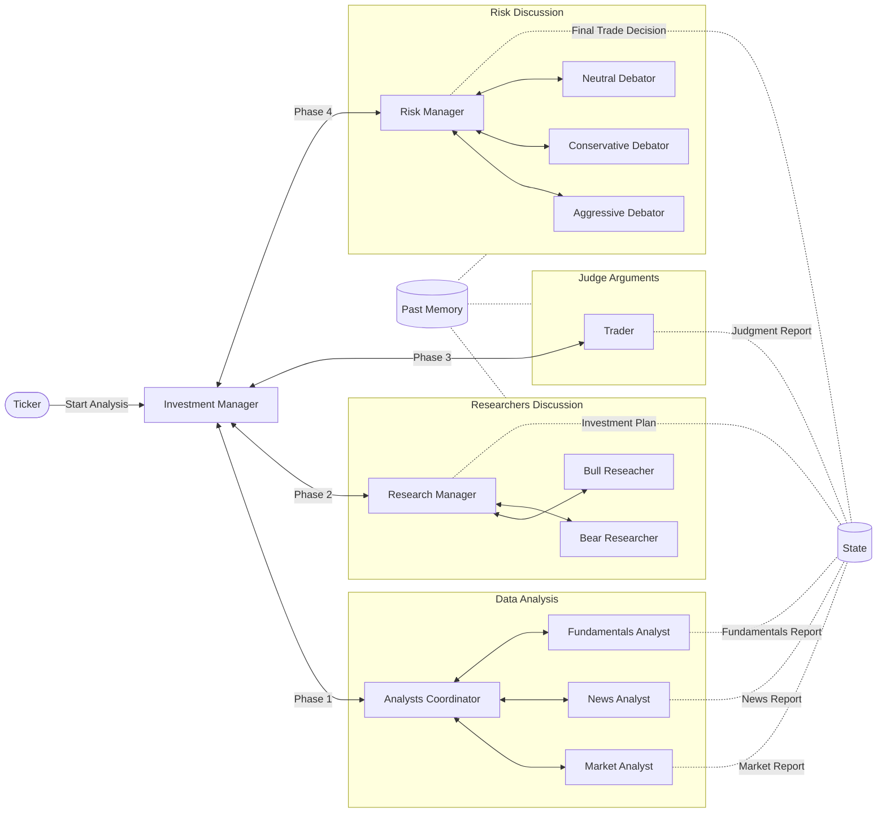

# Investment Manager - Architecture Diagram

## Simple Overview

```mermaid
flowchart LR
 subgraph subGraph0["Data Analysis"]
    direction TB
        AC["Analysts Coordinator"]
        MA["Market Analyst"]
        NA["News Analyst"]
        FA["Fundamentals Analyst"]
  end
 subgraph subGraph1["Researchers Discussion"]
        BR["Bull Reseacher"]
        BER["Bear Researcher"]
        RM["Research Manager"]
  end
 subgraph subGraph2["Judge Arguments"]
        TR["Trader"]
  end
 subgraph subGraph3["Risk Discussion"]
        AD["Aggressive Debator"]
        CD["Conservative Debator"]
        ND["Neutral Debator"]
        RMG["Risk Manager"]
  end
    Init(["Ticker"]) -- Start Analysis --> IM["Investment Manager"]
    IM <-- Phase 1 --> AC
    AC <--> MA & NA & FA
    IM <-- Phase 2 --> RM
    RM <--> BR & BER
    IM <-- Phase 3 --> TR
    IM <-- Phase 4 --> RMG
    RMG <--> AD & CD & ND
    MA -. Market Report .- State["State"]
    NA -. News Report .- State
    FA -. Fundamentals Report .- State
    RM -. Investment Plan .- State
    TR -. Judgment Report .- State
    RMG -. Final Trade Decision .- State
    State@{ shape: db}
    Memory["Past Memory"]
    Memory@{ shape: db}
    Memory -.- subGraph1 & subGraph2 & subGraph3


```

